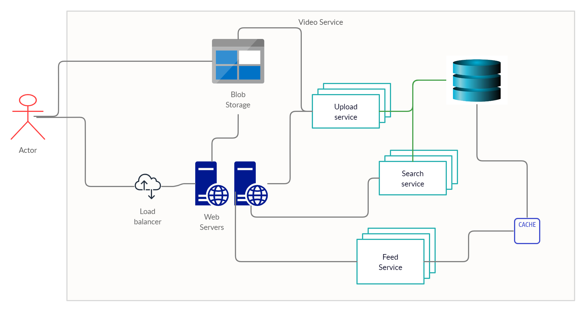
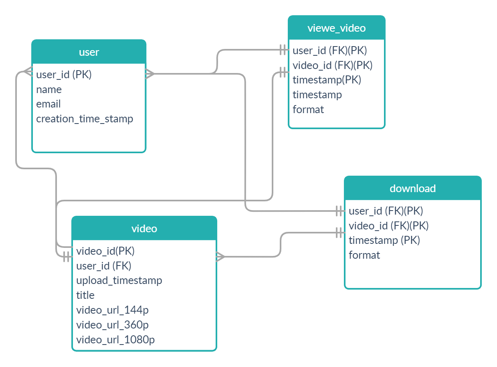

# Systems Team Technical Test
1. Prepare the environment and document the process
2. Implement a deployment pipeline in Jenkins
3. Startup videos / Understand code

## Prepare the environment and document the process
Use the scipt [install_ansible.sh](ansible_master/install_ansible.sh) for install ansible in a virtual env.

Use the scipt [install_jenkins.sh](ansible_master/install_jenkins.sh) for install jenkins it use the [ansible-playbook](ansible_master/jenkins_ansible/jenkins_playbook.yml).

 ### 1. Create a powershell script for IIS 
 - [powershell script](provisioning/windows/roles/iis/files/iis.ps1)

 ### 2. Create a script for jenkins jobs creations
 - [jenkins jobs script](ansible_master/jenkins_python/job_runner.py)

 ### 3. Create Ansible playbooks
 - [windows](provisioning/windows/playbook.yml)
 - [linux](provisioning/linux/playbook.yml)

## Implement a deployment pipeline in Jenkins

I created a new repo containing a [website](https://github.com/poperich/simpleweb.git), the pipeline takes care of copying the files inside the ansiblemaster host on which the Nginx service is installed.
I've inserted a Jankinsfile in the repo.
To create a new pipeline it's enough from the jenkis portal to create a new "Multibranch Pipeline" element and specify as Branch Sources https://github.com/poperich/simpleweb.git.
and configure Scan Repository Triggers.

## Startup videos / Understand code
 ### 5. Startup videos
5. Startup videos
A new startup company has requested our design advice for a new product. They want to create
a service for users for sharing videos. Basically, users will upload their videos then these videos
would be accessible to everyone. They expect to have 100M unique users and 2.5 videos each
user.
The POC must support these 3 use cases:
a. User uploads a video to the service
b. User can look up for a video in the service by title and can download it.
c. Main page shows the most viewed videos.
TASKS:
d. Design a proper architecture to support it, use a high-level diagram/schema to easily
show each component (servers, routers, balancers, external services, storage, databases,
webservers, etc.)
#### overview

The system is based on distributed architecture. The videos are stored in a blob storage, a possible product is Amazon S3 which guarantees replica availability and scalability.The information needed to provide the service is stored in a sql database, also in this case we suggest to use a cloud ervice such as Amazon RDS which guarantees backup and HA replication with the possibility of automatic and fast scaling in case of rapid system growth. The webservers and microservices that manage the functionality are delivered through Docker containers, these can be hosted on in house kubernates clusters or using cloud providers such as Amazon EKS. The use of kubernates clusters ensures that the various services can be scaled quickly and according to load, and also automatically manages load balancing.

With the exception of storage services using a proxy such as Nginx, you can think about creating a hybrid architecture by deploying containers to kubernate clusters on-premise and in the cloud.

#### sqltable

 ### 6. Understand code
 - [refactored code](code_optimization/code.cpp)
 Instead of calculating the distance of the abscissae and the ordinates twice, I created two variables.
 I eliminated the Sqrt calculation by changing the formula.
